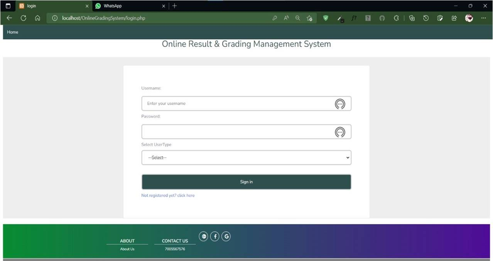
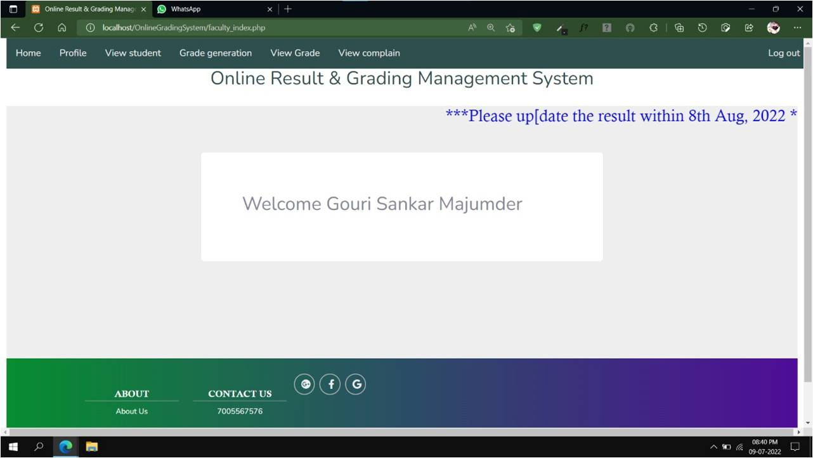
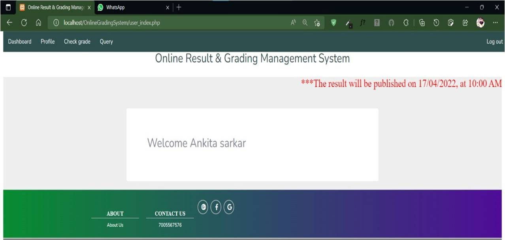
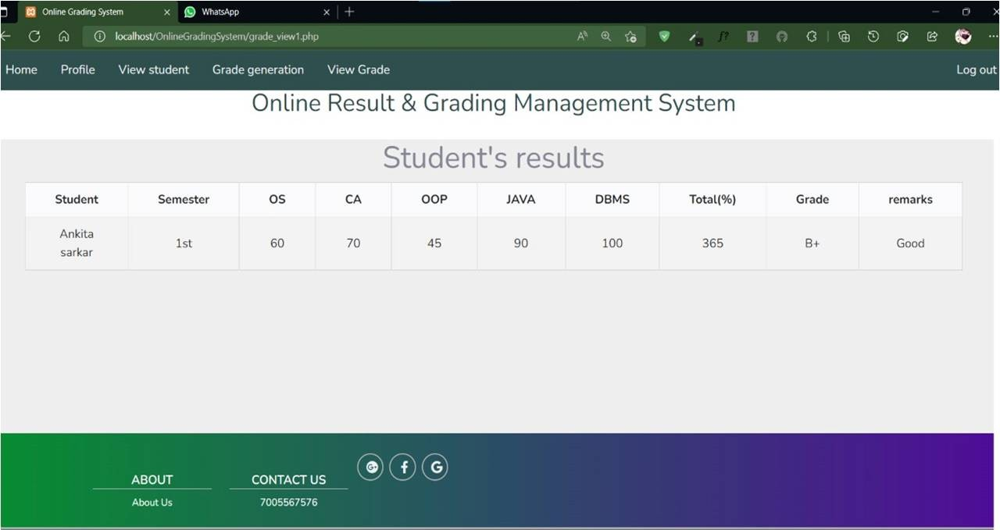
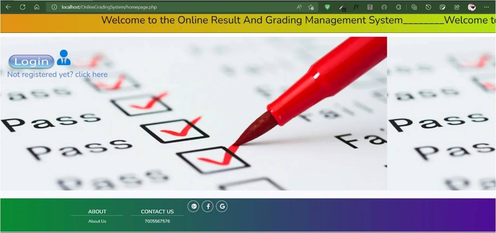

# 🎓 Online Grading & Student Management System

A web-based application designed to simplify academic management by providing secure access for **faculty** and **students**.  
The system enables grade management, attendance tracking, and streamlined communication between students and faculty members.

---

## 🚀 Features

### 👨‍🏫 Faculty Panel
- Secure faculty login  
- Add, update, and delete student marks  
- Manage student grades   
- View and respond to student queries  
- Search student records

### 👩‍🎓 Student Panel
- Secure student login  
- View marks, grades
- Submit queries to faculty  
- Track query responses from faculty members  

---

## 🛠️ Tech Stack
- **Frontend:** HTML, CSS, JavaScript  
- **Backend:** PHP  
- **Database:** MySQL  
- **Server:** XAMPP / WAMP / Localhost  

---

## 📁 Folder Structure

OnlineGradingSystem/

│── image/

│── online grading system

│── README.md

## 📸 Screenshots

### 🔐 Login Page

  

### 🧑‍🏫 Faculty Dashboard

  

### 🧑‍🎓 Student Dashboard

  

### 📝 Grade Management

  

### 💬 Home page

  

👩‍💻 Author

Ashmita Sarkar

Web Developer | Full Stack | PHP | MySQL

GitHub: @ashmitasarkar7640

📄 License

This project is for educational and learning purposes.

